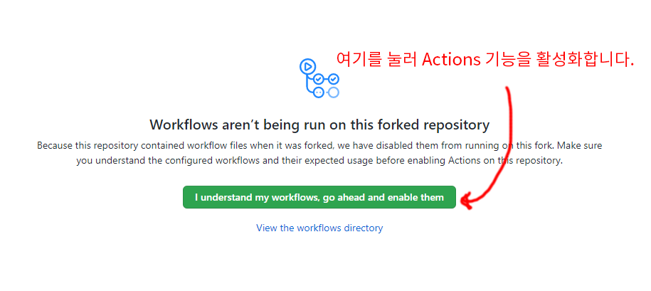
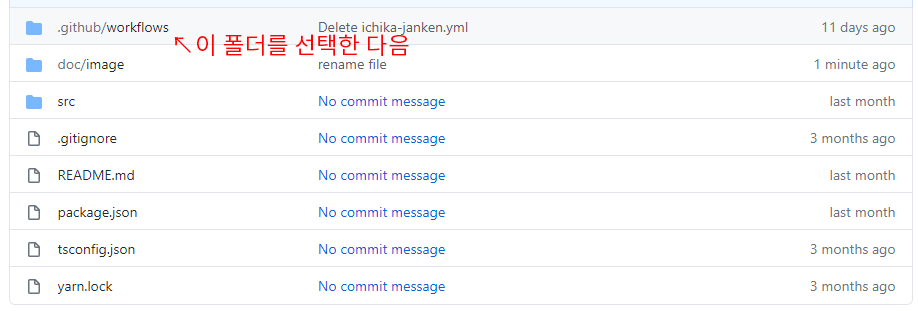
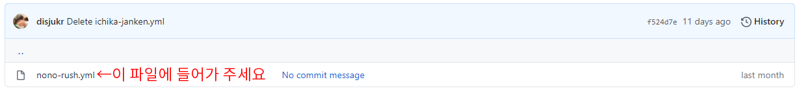
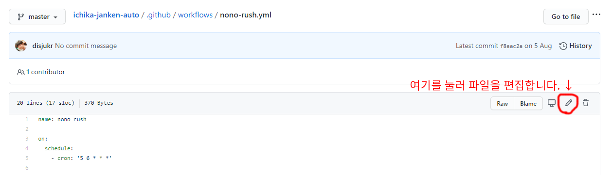
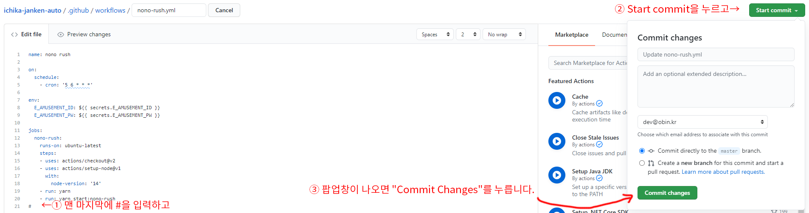

# ichika-janken-auto

코나미 리듬게임 해금 이벤트를 자동으로 진행해주는 스크립트입니다.

대응하는 해금 이벤트는 다음과 같습니다:

- ~~이치카 가위바위보~~ (이벤트 종료)
- 노노 러쉬 카드뒤집기

스탬프만 모아줍니다. 해금은 직접 진행해야 합니다.


## 면책조항

이 스크립트를 사용해서 발생하는 문제는 (스크립트가 버그 등으로 작동 안한다거나, 혹시나 코나미가 계정을 정지먹인다거나) 스크립트 제작자가 책임지지 않습니다.


## 사용법

### 준비사항

- 가위바위보 이벤트에 참여할 이어뮤 홈페이지 계정이 있어야 합니다.
- 아래 절차를 진행하려면 github에 로그인 돼있어야 합니다. 가입하는 방법은 알아서 찾아보세요.

### fork

우선 이 스크립트 저장소를 fork 합니다.\
github에서 fork를 한다는 것은 원본 저장소를 복제해서 내 저장소를 생성한다는 것을 뜻합니다.


### settings

우측 상단의 settings 버튼을 클릭해서 저장소 설정화면으로 들어갈 수 있습니다.


### secrets

자동 가위바위보 스크립트가 작동하려면 이어뮤 홈페이지 계정정보가 필요합니다.\
secret 기능을 이용해서 계정정보를 주입할 수 있습니다.


### new secret

아이디 secret과, 비밀번호 secret을 생성해주면 됩니다.

```
(복붙하세요)
E_AMUSEMENT_ID
E_AMUSEMENT_PW
```


### actions

Fork 된 저장소는 기본적으로 actions 기능이 꺼져 있습니다.



같은 이유로 workflow도 자동 등록되지 않으며, 등록하기 위해서는 파일에 변경사항을 만들어야 합니다.





(이벤트에 따라 파일 이름이 다를 수 있습니다.)





(`#` 기호는 주석을 의미합니다.)

~~자동 가위바위보는 매일 오전 10시 5분, 오후 3시 5분, 오후 8시 5분에 실행됩니다.~~ (이벤트 종료)

자동 카드뒤집기는 매일 오후 3시 5분에 실행됩니다.


### disable actions

이 스크립트는 이벤트 기간에 상관없이 계속해서 실행되므로 이벤트가 종료되면 더 이상 실행되지 않도록 해야합니다.

저장소의 `settings` -> `actions` 메뉴에서 `Disable Actions for this repository` 항목을 체크하면 더 이상 스크립트가 자동으로 실행되지 않습니다.


## credits

- [@Lapis](https://twitter.com/Lapis_BMS)
    - python 버전 작성
- [@ㄹ](https://twitter.com/disjukr)
    - typescript 버전으로 포팅
    - github actions 적용
    - 비전문가용 사용법 문서작성
- [dev.OBiN.kr](https://twitter.com/devOBiNkr)
    - 사용법 문서 갱신 (다중 이벤트 지원 관련)
